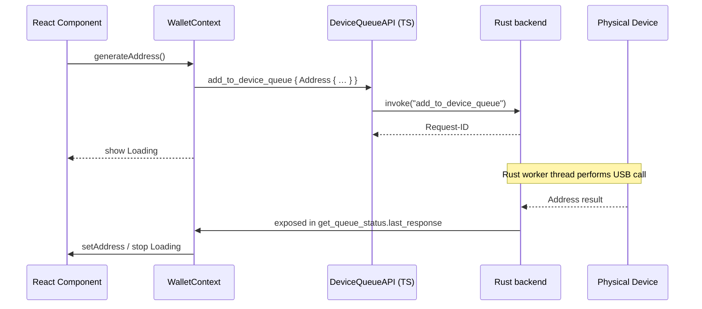

# Device Queue System – Vault v2

_Last updated: 2025-06-17_

## 1 Overview
The **device queue** isolates all hardware-wallet communication behind an asynchronous command queue processed by the Rust backend.  Browser/React code never speaks to the KeepKey directly; instead, it calls small **Tauri IPC commands** that push requests onto the queue and poll for results. This design allows:

* non-blocking UI – users can keep interacting while a request is in flight;
* serialised access – only one request is sent to a physical device at a time;
* cross-platform portability – the queue lives in Rust, re-usable for CLI and desktop builds.

## 2 Key Front-End Components
| File | Role |
| --- | --- |
| `src/lib/api.ts → DeviceQueueAPI` | Thin wrapper around `@tauri-apps/api/core.invoke` for **add_to_device_queue** / **get_queue_status**.  Handles request formatting. |
| `src/contexts/WalletContext.tsx` | Higher-level wallet logic. Calls `DeviceQueueAPI.requestReceiveAddressFromDevice` & `requestXpubFromDevice`, then **polls** `get_queue_status` every second until the matching response arrives. |
| `src/contexts/WalletContext.tsx → monitorQueue()` | Background job started in the provider that watches every connected device for new `last_response` values (xpub / address). Updates the SQLite cache and fires UI refreshes. |

### Typical Receive-Address Flow


## 3 Backend (Rust) Components
| File | Role |
| --- | --- |
| `src/device_queue.rs → DeviceQueue` | Holds per-device worker threads & broadcast channel for events. │
| (missing) tauri `#[command] fn add_to_device_queue(...)` | SHOULD push a `DeviceRequest` onto the queue and return a **request_id**. |
| (missing) tauri `#[command] fn get_queue_status(device_id)` | SHOULD return `QueueStatus { queue_length, processing, last_response }`. |
| `device_queue.rs → DeviceEvent` | Enum for Connected/Disconnected/StateChanged/QueueStatus events. |

### Gap Identified
The frontend calls `add_to_device_queue` / `get_queue_status`, but **no matching Tauri commands are registered** – hence the runtime error:
```
Failed to add address request to device queue: "Command add_to_device_queue not found"
```

## 4 Data Structures
```ts
// src/types/queue.ts
interface QueueStatus {
  device_id: string;
  queue_length: number;
  processing: boolean;
  last_response?: DeviceResponse;
}

type DeviceResponse =
  | { Xpub: { request_id: string; …; success: boolean; error?: string } }
  | { Address: { request_id: string; …; success: boolean; error?: string } };
```
Rust mirrors of these structs need to be exposed via `serde` so they can be returned to TypeScript.

## 5 Known Issues / Risks
1. **Missing backend commands** – blocks all queue functionality.
2. **Polling inefficiency** – `WalletContext` polls every second; consider websocket/broadcast over Tauri `listen` for push events.
3. **Hard-coded paths** – Bitcoin receive path is fixed to `m/84'/0'/0'/0/0`; should be configurable.
4. **Timeout logic duplicated** – `getReceiveAddress` waits up to 60 s; unify with a generic helper.
5. **Error propagation** – Currently string-based; define typed error enum for richer UX.

## 6 Recommendations & Next Steps
1. **Implement & register Tauri commands** in Rust:
   ```rust
   #[tauri::command]
   async fn add_to_device_queue(device_id: String, request: DeviceRequest) -> Result<String> { … }

   #[tauri::command]
   async fn get_queue_status(device_id: String) -> Result<QueueStatus> { … }
   ```
   Register them in `tauri::Builder`.
2. **Bridge models with `serde` & `ts-rs`** to keep TS/Rust types in sync.
3. **Replace polling** with event subscription using Tauri `emit_all` or broadcast channel so UI receives real-time updates.
4. **Abstract path/coin parameters** into helper util rather than literals.
5. **Persist queue between sessions** (optional) – write pending requests to disk for resume on crash.

---
© KeepKey Vault v2 Architecture Documentation
