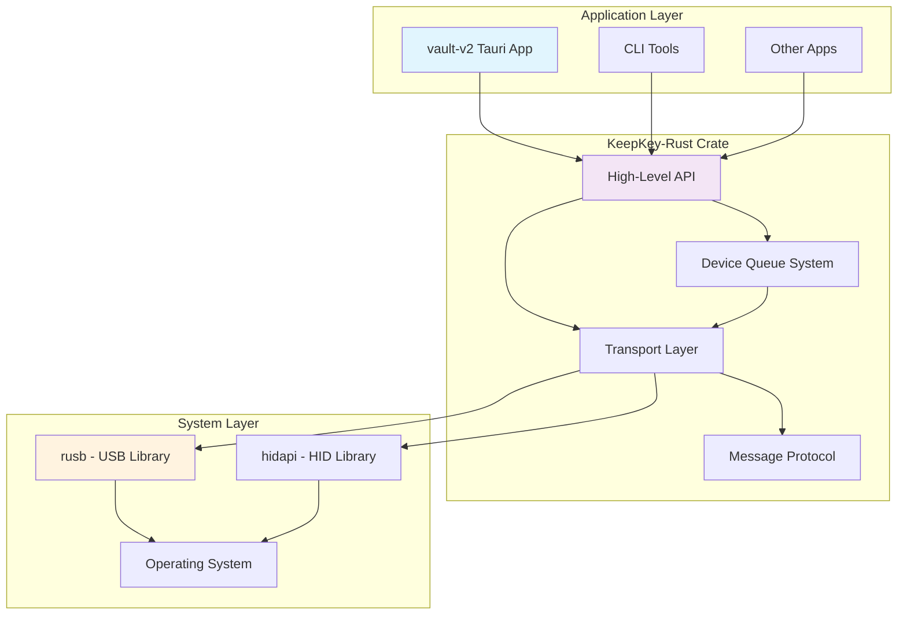

# KeepKey-Rust Integration Architecture

## 🏛️ **Overview**

This document defines the architectural boundaries and integration patterns for the KeepKey-Rust ecosystem. The goal is to maintain clean abstraction layers that prevent tight coupling between applications and low-level hardware communication details.

## 📊 **Architecture Diagram**



## 🎯 **Design Principles**

### 1. **Single Responsibility**
- **keepkey-rust**: Hardware communication and protocol handling
- **Applications**: UI, business logic, and user experience

### 2. **Abstraction Boundaries**
- Applications never import `rusb`, `hidapi`, or other low-level USB libraries
- All hardware details are encapsulated within keepkey-rust
- Clean, high-level APIs are the only interface between layers

### 3. **Dependency Direction**
```
Applications ──depends on──▶ keepkey-rust ──depends on──▶ System Libraries
```
Never: `System Libraries ←── Applications` (bypass keepkey-rust)

### 4. **Error Handling**
- keepkey-rust provides meaningful error messages
- Applications receive actionable error information
- Low-level transport errors are translated to user-friendly messages

## 📋 **API Contract**

### ✅ **Allowed Application Patterns**

```rust
// ✅ Device Discovery
use keepkey_rust::features::list_connected_devices;
let devices = list_connected_devices();

// ✅ Feature Retrieval
use keepkey_rust::features::get_device_features_by_id;
let features = get_device_features_by_id("device_id")?;

// ✅ Async Operations
use keepkey_rust::device_queue::DeviceQueueFactory;
let queue = DeviceQueueFactory::spawn_worker(id, device_info);
let address = queue.get_address(path, coin, script_type).await?;

// ✅ Type Usage
use keepkey_rust::friendly_usb::FriendlyUsbDevice;
use keepkey_rust::features::DeviceFeatures;
```

### ❌ **Prohibited Application Patterns**

```rust
// ❌ Direct USB Library Usage
use rusb::{Device, GlobalContext};  // NEVER import this in apps

// ❌ Low-Level Device Operations
let devices = rusb::devices().unwrap();  // NEVER do direct USB operations
let desc = device.device_descriptor().unwrap();  // This violates abstraction

// ❌ Manual Transport Creation
let transport = UsbTransport::new(&device, 0)?;  // Should be handled by keepkey-rust

// ❌ Direct Protocol Handling
let msg = Initialize::default().into();  // Applications shouldn't handle protocol
```

## 🏗️ **Layer Responsibilities**

### **Application Layer** (vault-v2, CLI tools)
- **Responsibilities**:
  - User interface and experience
  - Application-specific business logic
  - State management and persistence
  - Error presentation to users
  
- **Dependencies**:
  - `keepkey_rust` (only)
  - UI frameworks (Tauri, etc.)
  - Application-specific libraries

- **Exports**: None (applications are end-points)

### **KeepKey-Rust Crate**
- **Responsibilities**:
  - Device discovery and enumeration
  - Hardware communication protocols
  - Transport layer management (USB/HID)
  - Message encoding/decoding
  - Error translation and reporting
  - Device state management
  - Connection recovery and fallback

- **Dependencies**:
  - `rusb` (USB communication)
  - `hidapi` (HID communication)
  - `prost` (Protocol buffers)
  - `tokio` (Async runtime)
  - Other hardware-related crates

- **Exports**:
  ```rust
  pub mod features;       // Device discovery & feature detection
  pub mod device_queue;   // Async device operations
  pub mod friendly_usb;   // User-friendly device types
  ```

### **System Layer** (rusb, hidapi, OS)
- **Responsibilities**:
  - Low-level USB/HID communication
  - Operating system interfaces
  - Hardware device drivers

- **Dependencies**: Operating system APIs

- **Exports**: Low-level hardware access (consumed only by keepkey-rust)

## 🔧 **Integration Patterns**

### **Device Discovery Pattern**
```rust
// Application code (vault-v2)
use keepkey_rust::features::list_connected_devices;

#[tauri::command]
async fn list_devices() -> Result<Vec<FriendlyUsbDevice>, String> {
    let devices = list_connected_devices();
    Ok(devices)
}
```

### **Async Operations Pattern**
```rust
// Application code with device queue
use keepkey_rust::device_queue::{DeviceQueueFactory, DeviceQueueHandle};

type DeviceManager = Arc<Mutex<HashMap<String, DeviceQueueHandle>>>;

async fn get_device_features(
    device_id: String,
    manager: State<'_, DeviceManager>,
) -> Result<DeviceFeatures, String> {
    let handle = get_or_create_queue(device_id, manager).await?;
    let features = handle.get_features().await?;
    Ok(features)
}
```

### **Error Handling Pattern**
```rust
// keepkey-rust provides meaningful errors
match get_device_features_by_id(&device_id) {
    Ok(features) => Ok(features),
    Err(e) => {
        let user_message = if e.to_string().contains("not found") {
            "Device disconnected"
        } else if e.to_string().contains("permission") {
            "USB permission denied - check system settings"
        } else {
            "Device communication failed"
        };
        Err(user_message.to_string())
    }
}
```

## 📦 **Dependency Management**

### **Application Cargo.toml** (vault-v2)
```toml
[dependencies]
# ✅ ALLOWED: High-level keepkey library
keepkey_rust = { path = "../../keepkey-rust" }

# ✅ ALLOWED: Application-specific dependencies
tauri = { version = "2", features = [] }
serde = { version = "1", features = ["derive"] }
tokio = { version = "1", features = ["full"] }

# ❌ FORBIDDEN: Low-level hardware libraries
# rusb = "0.9"           # This should NEVER be in application dependencies
# hidapi = "1.4"         # This should NEVER be in application dependencies  
# hex = "0.4"            # Only if needed for non-keepkey operations
```

### **KeepKey-Rust Cargo.toml**
```toml
[dependencies]
# Hardware communication (internal use only)
rusb = "0.9"
hidapi = "1.4"

# Protocol handling (internal use only)
prost = "0.11"
hex = "0.4"

# Public API support
tokio = { version = "1", features = ["full"] }
serde = { version = "1", features = ["derive"] }
anyhow = "1.0"
```

## 🧪 **Testing Strategy**

### **Unit Tests** (keepkey-rust internal)
```rust
#[cfg(test)]
mod tests {
    use super::*;
    
    #[test]
    fn test_device_to_friendly_conversion() {
        // Test internal USB device conversion
    }
    
    #[test]
    fn test_transport_fallback() {
        // Test USB→HID fallback logic
    }
}
```

### **Integration Tests** (application level)
```rust
#[cfg(test)]
mod integration_tests {
    use keepkey_rust::features::list_connected_devices;
    
    #[tokio::test]
    async fn test_device_discovery() {
        let devices = list_connected_devices();
        // Test high-level API functionality
    }
}
```

## 🚨 **Common Anti-Patterns to Avoid**

### 1. **Leaky Abstraction**
```rust
// ❌ BAD: Exposing low-level types
pub fn get_raw_device() -> rusb::Device<GlobalContext> { ... }

// ✅ GOOD: High-level types only
pub fn get_device_info() -> FriendlyUsbDevice { ... }
```

### 2. **Dependency Pollution**
```rust
// ❌ BAD: Application imports low-level libraries
use rusb::Device;
use keepkey_rust::features::list_connected_devices;

// ✅ GOOD: Only high-level imports
use keepkey_rust::features::list_connected_devices;
use keepkey_rust::friendly_usb::FriendlyUsbDevice;
```

### 3. **Bypassing Abstraction**
```rust
// ❌ BAD: Application does USB operations
let devices = rusb::devices().unwrap();
for device in devices.iter() {
    let desc = device.device_descriptor().unwrap();
    // Manual USB string descriptor reading...
}

// ✅ GOOD: Use high-level API
let devices = keepkey_rust::features::list_connected_devices();
for device in devices {
    println!("Device: {}", device.name);
}
```

## 🔄 **Migration Guide**

### **From Violated Architecture to Clean Architecture**

#### Before (❌ Violated)
```rust
// vault-v2/Cargo.toml
[dependencies]
keepkey_rust = { path = "../../keepkey-rust" }
rusb = "0.9"  // ❌ Should not be here
hex = "0.4"   // ❌ Should not be here

// vault-v2/src/commands.rs
use rusb::{Device, GlobalContext};  // ❌ Low-level import

fn device_to_friendly(device: &rusb::Device<rusb::GlobalContext>) -> FriendlyUsbDevice {
    // ❌ Direct USB operations in application
    let desc = device.device_descriptor().unwrap();
    // ... manual USB string descriptor reading
}
```

#### After (✅ Clean)
```rust
// vault-v2/Cargo.toml
[dependencies]
keepkey_rust = { path = "../../keepkey-rust" }
# ✅ No low-level USB dependencies

// vault-v2/src/commands.rs
use keepkey_rust::features::list_connected_devices;  // ✅ High-level import

#[tauri::command]
async fn list_devices() -> Result<Vec<FriendlyUsbDevice>, String> {
    // ✅ Use high-level API
    let devices = list_connected_devices();
    Ok(devices)
}
```

## 📋 **Architecture Checklist**

Before merging code, verify:

- [ ] **No Low-Level Imports**: Applications don't import `rusb`, `hidapi`, etc.
- [ ] **Clean Dependencies**: Application `Cargo.toml` only has necessary high-level deps
- [ ] **Abstraction Respected**: No direct USB/HID operations in applications
- [ ] **Error Handling**: Meaningful errors are provided by keepkey-rust
- [ ] **Documentation**: APIs are documented with proper usage examples
- [ ] **Testing**: Both unit tests (keepkey-rust) and integration tests (applications)

## 🎯 **Benefits of This Architecture**

1. **Maintainability**: Changes to USB/HID handling don't affect applications
2. **Testability**: Applications can be tested without hardware dependencies
3. **Reusability**: Multiple applications can use the same hardware abstraction
4. **Debugging**: Clear separation makes issue diagnosis easier
5. **Cross-platform**: Hardware compatibility handled in one place
6. **Performance**: Efficient caching and connection management in keepkey-rust

## 🔗 **References**

- [KeepKey-Rust README](../../projects/keepkey-rust/README.md)
- [Vault-v2 README](../../projects/vault-v2/README.md)
- [Clean Architecture Principles](https://blog.cleancoder.com/uncle-bob/2012/08/13/the-clean-architecture.html) 