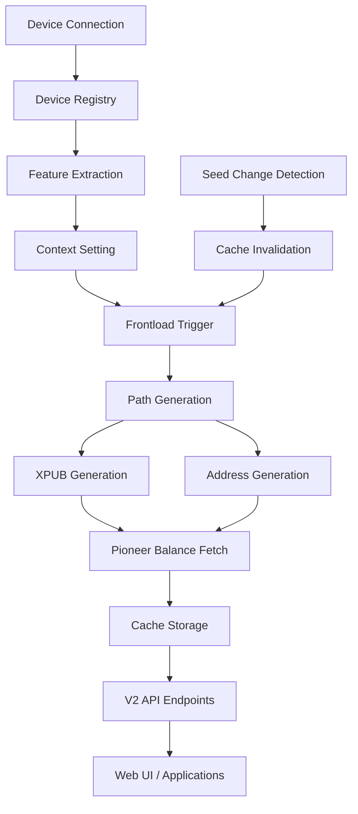

# KeepKey Frontload Architecture

## Overview

The KeepKey frontload system is designed to proactively cache device-specific cryptographic data (XPUBs, addresses, balances) to enable fast, offline wallet operations while supporting multiple devices and multiple seeds per device.

## Core Principles

### 1. Multi-Device Support
- **Device Registry**: Central registry tracks all connected/disconnected devices by unique ID
- **Device Context**: Active device context for API operations (can switch between devices)
- **Isolated Data**: Each device's data is completely isolated in the cache database

### 2. Multi-Seed Support
- **Seed Isolation**: Each device can have data from different seed phrases
- **Cache Invalidation**: When device is wiped/reinitialized, cache is cleared automatically
- **Seed Detection**: System detects seed changes via master public key comparison

### 3. Fail-Fast Philosophy
- **Transport Conflicts**: Gracefully handle concurrent device access
- **Pioneer Integration**: Test local Pioneer server before deploying to production
- **Data Integrity**: Never mock data - always use real device communication when possible

## Data Architecture

### Database Schema

```sql
-- Device-specific features and metadata
CREATE TABLE device_features (
    device_id TEXT PRIMARY KEY,
    label TEXT,
    firmware_version TEXT,
    initialized BOOLEAN,
    features_json TEXT,
    last_seen INTEGER
);

-- Derivation paths for address generation
CREATE TABLE paths (
    id INTEGER PRIMARY KEY,
    device_id TEXT,
    address_n_list TEXT,        -- Account-level path (m/44'/0'/0')
    address_n_list_master TEXT, -- Address-level path (m/44'/0'/0'/0/0)
    script_type TEXT,           -- p2pkh, p2wpkh, p2sh-p2wpkh
    networks TEXT,              -- JSON array of supported networks
    blockchain TEXT,
    symbol TEXT,
    FOREIGN KEY(device_id) REFERENCES device_features(device_id)
);

-- Cached addresses and XPUBs
CREATE TABLE cached_addresses (
    id INTEGER PRIMARY KEY,
    device_id TEXT,
    coin_name TEXT,
    script_type TEXT,
    address_n_list TEXT,        -- Derivation path as JSON array
    address TEXT,               -- Address or XPUB value
    pubkey TEXT,                -- Public key (optional)
    FOREIGN KEY(device_id) REFERENCES device_features(device_id)
);

-- Balance data from Pioneer API
CREATE TABLE cached_balances (
    id INTEGER PRIMARY KEY,
    device_id TEXT,
    caip TEXT,                  -- Chain Agnostic Improvement Proposal identifier
    pubkey TEXT,                -- XPUB or address used for balance lookup
    balance TEXT,               -- Raw balance (e.g., "0.00123456")
    price_usd TEXT,             -- Price per unit in USD
    value_usd TEXT,             -- Total value in USD
    symbol TEXT,                -- BTC, ETH, etc.
    network_id TEXT,            -- Network identifier
    last_updated INTEGER,       -- Unix timestamp
    FOREIGN KEY(device_id) REFERENCES device_features(device_id)
);
```

### Data Flow



## Frontload Process

### 1. Device Detection & Registration
```rust
// Device appears via USB
device_controller.device_arrived(device) -> {
    // 1. Add to device registry
    device_registry::add_device(device);
    
    // 2. Fetch features
    let features = get_device_features(device);
    
    // 3. Check if ready for frontload
    if is_device_ready(features) {
        trigger_frontload(device_id);
    }
}
```

### 2. Frontload Execution
```rust
async fn frontload_all() -> Result<()> {
    // 1. Load device features (from registry if transport unavailable)
    let (features, device_id) = frontload_features().await?;
    
    // 2. Save features to cache
    cache.save_features(&features, &device_id).await?;
    
    // 3. Load existing device data into memory
    cache.load_device(&device_id).await?;
    
    // 4. Ensure default paths are available
    ensure_all_default_paths_loaded().await?;
    
    // 5. Generate missing addresses and XPUBs
    let addresses_loaded = populate_missing_addresses(&device_id).await?;
    
    // 6. Fetch balances from Pioneer API
    frontload_balances(&device_id).await?;
    
    Ok(())
}
```

### 3. Address & XPUB Generation Strategy

#### UTXO Networks (Bitcoin, Litecoin, etc.)
- **XPUBs**: Generated at account level (m/44'/0'/0') for balance queries
- **Addresses**: Generated for first 5 receiving addresses (m/44'/0'/0'/0/0-4)
- **Change Addresses**: Generated for first 5 change addresses (m/44'/0'/0'/1/0-4)

#### Account Networks (Ethereum, Cosmos, etc.)
- **Addresses**: Single address per network at master path (m/44'/60'/0'/0/0)
- **No XPUBs**: Account-based networks use direct address lookup

```rust
// Example: Bitcoin SegWit (P2SH-P2WPKH)
let account_path = [44, 0, 0]; // m/44'/0'/0'
let xpub = get_xpub(device, "Bitcoin", "p2sh-p2wpkh", &account_path);

// Generate receive addresses
for i in 0..5 {
    let address_path = [44, 0, 0, 0, i]; // m/44'/0'/0'/0/i
    let address = get_address(device, "Bitcoin", "p2sh-p2wpkh", &address_path);
    cache.save_address(device_id, "Bitcoin", "p2sh-p2wpkh", &address_path, &address);
}

// Save XPUB with special script type marker
cache.save_address(device_id, "Bitcoin", "p2sh-p2wpkh_xpub", &account_path, &xpub);
```

## Multi-Device Context Switching

### Context Management
```rust
pub struct DeviceContext {
    pub device_id: String,
    pub device_label: Option<String>,
    pub eth_address: String,
}

// Global context state
static DEVICE_CONTEXT: Arc<RwLock<Option<DeviceContext>>> = Arc::new(RwLock::new(None));

// API endpoint to switch context
POST /api/context
{
    "device_id": "343737340F4736331F003B00",
    "device_label": "KeepKey3", 
    "eth_address": "0x141d9959cae3853b035000490c03991eb70fc4ac"
}
```

### Context-Aware API Endpoints
```rust
// All v2 endpoints filter by current device context
pub async fn get_pubkeys(State(app_state): State<Arc<AppState>>) -> impl IntoResponse {
    let device_id = match app_state.device_cache.get_device_id() {
        Some(id) => id,
        None => return error_response("No device context set")
    };
    
    // Return only data for current device
    let pubkeys = app_state.device_cache.get_cached_addresses(&device_id).await?;
    Json(pubkeys).into_response()
}
```

## Pioneer API Integration

### Balance Fetching Strategy
```rust
async fn refresh_balances_from_pioneer(device_id: &str) -> Result<()> {
    let paths = cache.get_paths().await?;
    let mut asset_queries = Vec::new();
    
    for path in paths {
        for network in &path.networks {
            let caip = network_to_caip(network)?;
            
            if network.starts_with("bip122:") {
                // UTXO networks: Use XPUB for balance lookup
                let xpub = get_cached_xpub(device_id, &path).await?;
                asset_queries.push(json!({
                    "caip": caip,
                    "pubkey": xpub
                }));
            } else {
                // Account networks: Use address for balance lookup  
                let address = get_cached_address(device_id, &path).await?;
                asset_queries.push(json!({
                    "caip": caip,
                    "pubkey": address
                }));
            }
        }
    }
    
    // Send batch request to Pioneer
    let response = client.post("/api/v1/portfolio")
        .json(&asset_queries)
        .send().await?;
    
    let balances: Vec<Balance> = response.json().await?;
    cache.save_balances(device_id, &balances).await?;
}
```

### CAIP Mapping
```rust
fn network_to_caip(network: &str) -> Result<String> {
    match network {
        // Bitcoin networks
        n if n.starts_with("bip122:000000000019d6689c085ae165831e93") => 
            Ok("bip122:000000000019d6689c085ae165831e93/slip44:0".to_string()),
        
        // Ethereum networks
        n if n.starts_with("eip155:1") => 
            Ok("eip155:1/slip44:60".to_string()),
            
        // Additional networks...
        _ => Err(anyhow!("Unsupported network: {}", network))
    }
}
```

## Transport Management

### Concurrent Access Handling
The system handles concurrent device access gracefully:

```rust
// Primary approach: Use existing device manager connection
async fn frontload_features(&self) -> Result<(Features, String)> {
    let transport_opt_guard = self.transport_arc.lock().await;
    if transport_opt_guard.is_some() {
        // Use transport if available
        let features = get_features_from_transport().await?;
        Ok(features)
    } else {
        // Fallback: Use cached features from device registry
        let features = get_features_from_registry().await?;
        Ok(features)
    }
}

// Address generation with graceful degradation
async fn get_and_cache_xpub(&self, device_id: &str, coin_name: &str, script_type: &str, path: &[u32]) -> Result<String> {
    let transport_opt_guard = self.transport_arc.lock().await;
    if transport_opt_guard.is_none() {
        warn!("⚠️  No transport available for XPUB generation, skipping {} {} at path {:?}", 
              coin_name, script_type, path);
        return Err(anyhow!("Transport not available - device communication required for XPUB generation"));
    }
    
    // Continue with device communication...
    let xpub = get_xpub_from_device(path).await?;
    cache.save_address(device_id, coin_name, &format!("{}_xpub", script_type), path, &xpub).await?;
    Ok(xpub)
}
```

## API Endpoints

### V2 REST API
```
GET  /api/v2/pubkeys          # Get all cached pubkeys/xpubs for current device
GET  /api/v2/paths            # Get all derivation paths for current device  
GET  /api/v2/balances         # Get all balances for current device
GET  /api/v2/portfolio/summary # Get portfolio summary for current device

POST /api/context             # Set active device context
GET  /api/context             # Get current device context
DELETE /api/context           # Clear device context

POST /api/frontload           # Manually trigger frontload process
```

### Multi-Device Testing
```javascript
// Test switching between devices
const devices = [
    { id: '343737340F4736331F003B00', label: 'KeepKey3' },
    { id: '343737340F4736331F003B01', label: 'KeepKey4' }
];

for (const device of devices) {
    // Set context
    await axios.post('/api/context', { device_id: device.id });
    
    // Verify data isolation
    const pubkeys = await axios.get('/api/v2/pubkeys');
    const balances = await axios.get('/api/v2/balances');
    
    console.log(`Device ${device.label}: ${pubkeys.data.length} pubkeys, ${balances.data.length} balances`);
}
```

## Future Enhancements

### 1. Seed Change Detection
```rust
// Detect when device seed has changed
async fn validate_device_cache(device_id: &str) -> Result<bool> {
    let cached_master_key = cache.get_master_public_key(device_id).await?;
    let current_master_key = get_master_public_key_from_device().await?;
    
    if cached_master_key != current_master_key {
        warn!("Seed change detected for device {}", device_id);
        cache.clear_device_data(device_id).await?;
        return Ok(true); // Cache was cleared
    }
    
    Ok(false) // Cache is valid
}
```

### 2. Hierarchical Caching
- **L1 Cache**: In-memory cache for frequently accessed data
- **L2 Cache**: SQLite database for persistent storage
- **L3 Cache**: Pioneer API for balance updates

### 3. Background Sync
```rust
// Periodic background refresh
async fn background_balance_refresh() {
    let devices = get_all_connected_devices().await;
    
    for device in devices {
        if let Err(e) = refresh_balances_from_pioneer(&device.id).await {
            warn!("Background refresh failed for {}: {}", device.id, e);
        }
    }
}
```

## Testing Strategy

### Local Pioneer Testing
1. **Start Local Pioneer**: `docker run -p 9001:9001 pioneer:latest`
2. **Run Test Suite**: `node tests/test-pioneer-live.js`
3. **Validate Integration**: Ensure XPUBs from frontload work with Pioneer
4. **Multi-Device Test**: Switch contexts and verify data isolation

### Production Deployment
1. **Local Testing Pass**: All tests pass on 127.0.0.1:9001
2. **Pioneer.dev Integration**: Update configuration to use pioneer.dev
3. **End-to-End Testing**: Full wallet operations with live data
4. **Performance Monitoring**: Track frontload times and API response times

This architecture ensures robust, scalable support for multiple KeepKey devices with different seed phrases while maintaining data integrity and providing fast, offline-capable wallet operations. 