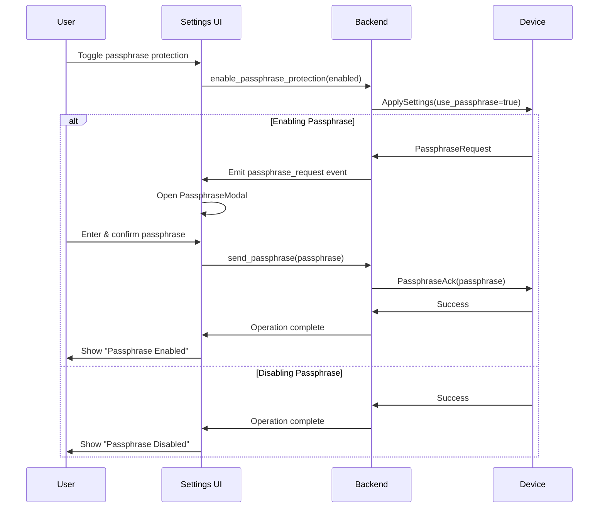
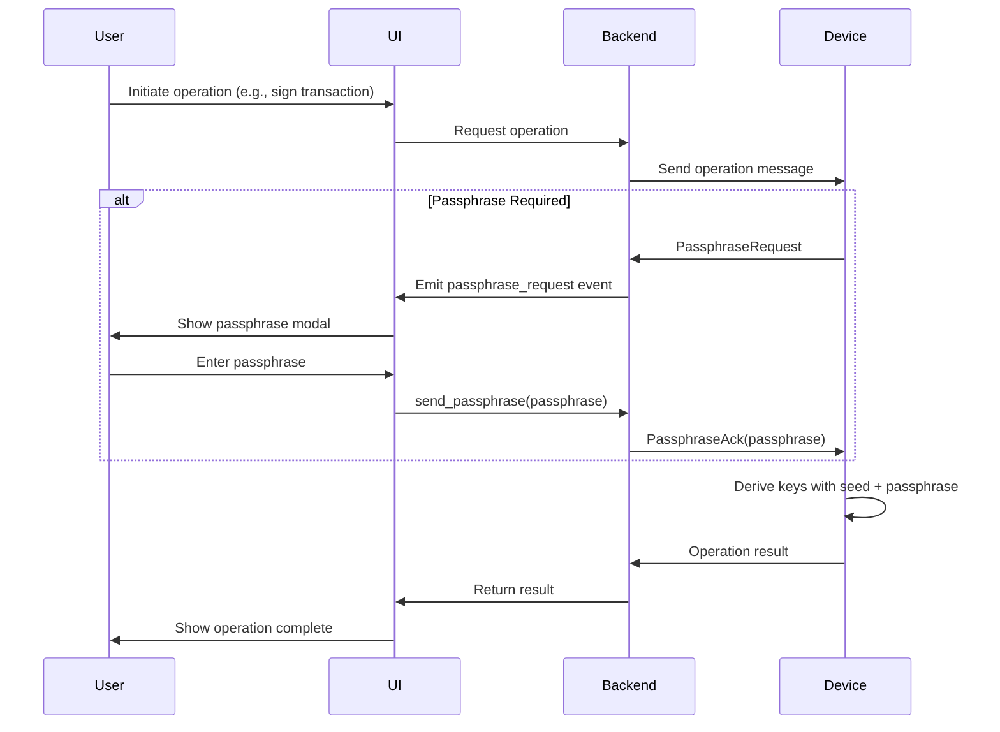

# KeepKey Bitcoin-Only Passphrase Implementation Plan

## Executive Summary

This document outlines the implementation plan for BIP39 passphrase support in the KeepKey Bitcoin-only wallet. The passphrase feature adds an additional layer of security by allowing users to create hidden wallets derived from their seed phrase combined with a user-defined passphrase.

## Current State Analysis

### Protocol Layer
The KeepKey device protocol already supports passphrase functionality through the following message flow:
1. **PassphraseRequest** - Device requests passphrase from host
2. **PassphraseAck** - Host sends passphrase back to device
3. **PassphraseStateRequest** - Optionally manage passphrase state
4. **PassphraseStateAck** - Acknowledge passphrase state

### Two-Way Communication Flow

The passphrase system uses a bidirectional communication pattern:

#### Enabling Passphrase Protection
1. **Host → Device**: User toggles passphrase protection in settings
2. **Host → Device**: `ApplySettings` message with `use_passphrase=true`
3. **Device → Host**: Device responds with `PassphraseRequest` 
4. **Host**: Opens passphrase entry modal for user
5. **User**: Enters and confirms passphrase
6. **Host → Device**: `PassphraseAck` with entered passphrase
7. **Device**: Stores passphrase protection flag (not the passphrase itself)
8. **Device → Host**: Success response
9. **Host**: Updates UI to show passphrase enabled

#### Using Passphrase-Protected Device
1. **Host → Device**: Any operation requiring private keys (sign, derive address, etc.)
2. **Device → Host**: `PassphraseRequest` if passphrase not cached
3. **Host**: Opens passphrase entry modal
4. **User**: Enters passphrase
5. **Host → Device**: `PassphraseAck` with passphrase
6. **Device**: Derives keys using seed + passphrase
7. **Device → Host**: Continues with requested operation

### HDWallet Integration
The hdwallet-core and hdwallet-keepkey packages have existing passphrase support:
- `sendPassphrase(passphrase: string)` method in wallet interface
- Event system includes `PASSPHRASE_REQUEST` event type
- Integration with device message handling

### Current Desktop Implementation
The keepkey-desktop-v3 has basic passphrase handling in:
- Rust transport layer with CLI passphrase input
- Protocol buffer definitions for passphrase messages
- Basic UI modal system for user input

## Implementation Requirements

### Core Features
1. **Passphrase Entry UI**
   - Secure input field with show/hide toggle
   - Confirmation field to prevent typos
   - Clear warning about passphrase consequences
   - Option to enable/disable passphrase protection

2. **Security Considerations**
   - Passphrase should never be stored persistently
   - Clear from memory after use
   - Warning about lost passphrases (unrecoverable)
   - Different wallet derivation for each passphrase

3. **User Experience Flow**
   - Prompt for passphrase when accessing protected wallet
   - Clear indication when passphrase mode is active
   - Ability to clear session and switch passphrases
   - Educational content about passphrase usage

## Technical Architecture

### Component Structure
```
┌─────────────────────────────────────┐
│         Frontend (React/TS)         │
├─────────────────────────────────────┤
│    PassphraseModal Component        │
│    PassphraseSettings Component     │
│    PassphraseWarning Component      │
├─────────────────────────────────────┤
│       Tauri Backend (Rust)          │
├─────────────────────────────────────┤
│    Device Communication Layer        │
│    Message Handler                  │
│    Session Manager                  │
├─────────────────────────────────────┤
│      Device Protocol Layer          │
└─────────────────────────────────────┘
```

### Message Flow

#### Enable/Disable Passphrase Flow


#### Regular Operation with Passphrase


## Implementation Phases

### Phase 1: Core Infrastructure
**Timeline: 1 week**
- [ ] Implement passphrase message handling in Rust backend
- [ ] Create event system for passphrase requests
- [ ] Add session management for passphrase state
- [ ] Implement secure memory handling

### Phase 2: User Interface
**Timeline: 1 week**
- [ ] Create PassphraseModal component
- [ ] Implement secure input fields with validation
- [ ] Add passphrase settings in device configuration
- [ ] Create warning/educational dialogs

### Phase 3: Integration & Testing
**Timeline: 1 week**
- [ ] Integrate with existing wallet operations
- [ ] Test passphrase derivation paths
- [ ] Verify address generation with passphrases
- [ ] Test session clearing and switching

### Phase 4: Security Audit & Polish
**Timeline: 1 week**
- [ ] Security review of implementation
- [ ] Memory clearing verification
- [ ] UI/UX testing and refinement
- [ ] Documentation and user guides

## User Interface Design

### Passphrase Entry Modal
```
┌──────────────────────────────────────┐
│     Enter BIP39 Passphrase           │
├──────────────────────────────────────┤
│                                      │
│  ⚠️ Warning: This passphrase cannot  │
│  be recovered if lost!               │
│                                      │
│  Passphrase:                         │
│  ┌──────────────────────────┐ [👁]   │
│  │                          │        │
│  └──────────────────────────┘        │
│                                      │
│  Confirm Passphrase:                 │
│  ┌──────────────────────────┐        │
│  │                          │        │
│  └──────────────────────────┘        │
│                                      │
│  □ I understand this creates a       │
│    completely different wallet        │
│                                      │
│  [Cancel]            [Continue]      │
└──────────────────────────────────────┘
```

### Settings Interface
```
┌──────────────────────────────────────┐
│     Security Settings                │
├──────────────────────────────────────┤
│                                      │
│  Passphrase Protection:              │
│  [○ Disabled  ● Enabled]             │
│                                      │
│  When enabled, you'll be prompted    │
│  for a passphrase to access your     │
│  wallet. Different passphrases       │
│  create different wallets.           │
│                                      │
│  [Learn More]                        │
│                                      │
└──────────────────────────────────────┘
```

## Security Considerations

### Critical Security Requirements
1. **Memory Security**
   - Use secure string handling
   - Clear passphrase from memory immediately after use
   - Prevent passphrase from appearing in logs or debug output

2. **User Education**
   - Clear warnings about irrecoverable passphrases
   - Explanation of how passphrases create different wallets
   - Best practices for passphrase creation and storage

3. **Session Management**
   - Auto-clear passphrase after timeout
   - Clear indication of active passphrase session
   - Secure session token generation

### Threat Model
- **Keyloggers**: Use secure input methods where possible
- **Screen recording**: Implement optional on-screen keyboard
- **Memory dumps**: Clear sensitive data immediately
- **Physical access**: Device PIN protection remains primary defense

## Testing Strategy

### Unit Tests
- Passphrase message encoding/decoding
- Session management logic
- Memory clearing verification

### Integration Tests
- Full message flow testing
- Address derivation with various passphrases
- Session timeout and clearing

### Manual Testing Checklist
- [ ] Enter passphrase and verify correct wallet access
- [ ] Different passphrases create different wallets
- [ ] Passphrase field validation (matching confirmation)
- [ ] Warning dialogs appear appropriately
- [ ] Session clearing works correctly
- [ ] UI is responsive and clear

## Code Examples

### Rust Backend Handler
```rust
#[derive(Clone, serde::Serialize)]
struct PassphraseRequestPayload {
    #[serde(rename = "requestId")]
    request_id: String,
}

#[tauri::command]
async fn handle_passphrase_request(
    app_handle: tauri::AppHandle,
    device_id: String,
) -> Result<(), String> {
    let payload = PassphraseRequestPayload {
        request_id: uuid::Uuid::new_v4().to_string(),
    };
    
    app_handle
        .emit_all("passphrase_request", payload)
        .map_err(|e| e.to_string())?;
    
    Ok(())
}

#[tauri::command]
async fn send_passphrase(
    passphrase: String,
    device_id: String,
) -> Result<(), String> {
    // Send PassphraseAck to device
    let msg = PassphraseAck {
        passphrase: passphrase.clone(),
    };
    
    // Clear passphrase from memory after sending
    drop(passphrase);
    
    send_to_device(device_id, msg).await
}
```

### React Component
```typescript
interface PassphraseModalProps {
  isOpen: boolean;
  onClose: () => void;
  onSubmit: (passphrase: string) => void;
}

const PassphraseModal: React.FC<PassphraseModalProps> = ({
  isOpen,
  onClose,
  onSubmit,
}) => {
  const [passphrase, setPassphrase] = useState('');
  const [confirmPassphrase, setConfirmPassphrase] = useState('');
  const [showPassphrase, setShowPassphrase] = useState(false);
  const [understood, setUnderstood] = useState(false);
  
  const handleSubmit = () => {
    if (passphrase !== confirmPassphrase) {
      alert('Passphrases do not match');
      return;
    }
    
    if (!understood) {
      alert('Please confirm you understand the warning');
      return;
    }
    
    onSubmit(passphrase);
    // Clear sensitive data
    setPassphrase('');
    setConfirmPassphrase('');
  };
  
  return (
    <Modal isOpen={isOpen} onClose={onClose}>
      <div className="passphrase-modal">
        <h2>Enter BIP39 Passphrase</h2>
        
        <div className="warning">
          ⚠️ Warning: This passphrase cannot be recovered if lost!
        </div>
        
        <div className="input-group">
          <label>Passphrase:</label>
          <input
            type={showPassphrase ? 'text' : 'password'}
            value={passphrase}
            onChange={(e) => setPassphrase(e.target.value)}
            autoComplete="off"
          />
          <button onClick={() => setShowPassphrase(!showPassphrase)}>
            {showPassphrase ? '🙈' : '👁'}
          </button>
        </div>
        
        <div className="input-group">
          <label>Confirm Passphrase:</label>
          <input
            type="password"
            value={confirmPassphrase}
            onChange={(e) => setConfirmPassphrase(e.target.value)}
            autoComplete="off"
          />
        </div>
        
        <label className="checkbox">
          <input
            type="checkbox"
            checked={understood}
            onChange={(e) => setUnderstood(e.target.checked)}
          />
          I understand this creates a completely different wallet
        </label>
        
        <div className="button-group">
          <button onClick={onClose}>Cancel</button>
          <button 
            onClick={handleSubmit}
            disabled={!passphrase || !confirmPassphrase || !understood}
          >
            Continue
          </button>
        </div>
      </div>
    </Modal>
  );
};
```

## Best Practices & Recommendations

### For Users
1. **Passphrase Creation**
   - Use a strong, memorable passphrase
   - Consider using a password manager for backup
   - Never share your passphrase with anyone
   - Test with small amounts first

2. **Security Tips**
   - Different passphrases = different wallets
   - Can be used for plausible deniability
   - Keep a secure backup of your passphrase
   - Consider using for high-value storage only

### For Developers
1. **Code Quality**
   - Always clear sensitive data from memory
   - Use constant-time comparison for validation
   - Implement proper error handling
   - Add comprehensive logging (without sensitive data)

2. **User Experience**
   - Make warnings clear and prominent
   - Provide educational resources
   - Allow users to verify their passphrase worked
   - Implement graceful error recovery

## Migration Path

For existing KeepKey users:
1. Passphrase feature is opt-in
2. Existing wallets continue to work without passphrase
3. Can enable passphrase protection at any time
4. Can disable passphrase (returns to standard wallet)

## Success Metrics

- Zero security incidents related to passphrase implementation
- User satisfaction score > 4.5/5 for passphrase UX
- < 1% support tickets related to passphrase confusion
- 100% test coverage for security-critical code
- Performance impact < 100ms for passphrase operations

## Conclusion

The passphrase implementation for KeepKey Bitcoin-only wallet will provide users with an additional security layer while maintaining simplicity and usability. By following this plan, we can deliver a secure, user-friendly implementation that aligns with Bitcoin best practices and KeepKey's security standards.

## References

- [BIP39 Specification](https://github.com/bitcoin/bips/blob/master/bip-0039.mediawiki)
- [KeepKey Protocol Documentation](https://github.com/keepkey/device-protocol)
- [HDWallet Core Documentation](https://github.com/shapeshift/hdwallet)
- [Trezor Passphrase Documentation](https://wiki.trezor.io/Passphrase)