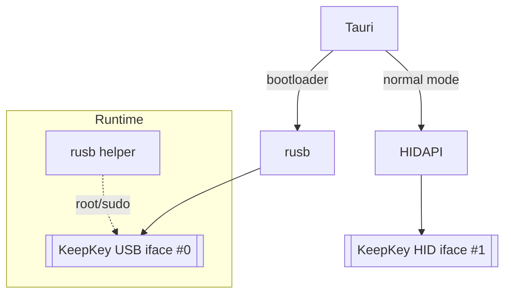

## USB HID in Tauri, Start-to-Finish Guide
A field-tested checklist for getting a **KeepKey** – or any USB-HID device – working in a Tauri desktop app on **macOS, Windows, and Linux**.  
Includes working Rust/Tauri snippets, common pitfalls (*“Failed to claim interface 1: Access”*), and real-world projects you can crib from.

---

### 1 Why interface 0 opens but interface 1 fails

| Interface | Class | Who owns it by default | Can libusb claim it? | Notes |
|-----------|-------|------------------------|----------------------|-------|
| **#0**    | Vendor/Bulk (bootloader) | Unclaimed | ✅ Everywhere | Good for firmware flashing, DFU, low-level debug |
| **#1**    | HID (normal mode)        | OS HID driver | ❌ macOS / rootless Linux / user-mode Windows | Detach blocked on macOS; use `hidapi` everywhere for user-mode access |

* **Linux** – Detach possible if the user has permission **and** you call `set_auto_detach_kernel_driver(true)`.
* **macOS** – Detaching HID is **not allowed**; use IOKit/HID-Manager (`hidapi` handles this).
* **Windows** – Stock HID driver allows shared R/W *unless* WinUSB/libusbK replaced it and you open “raw USB”.

Hence the *Access denied* error when claiming interface 1 with `rusb`.  
**Fix:** use **hidapi** (via `tauri-plugin-hid`) for interface 1 and keep `rusb` only for discovery/bootloader tasks.

> **Example project:** [`tauri-plugin-hid`](https://github.com/tauri-apps/plugins-workspace/tree/v2/plugins/hid) – MIT-licensed, wraps `hidapi` and exposes it to JS.

---

### 2 Cross-platform permission checklist

| Platform | What you **must** do | One-liner to verify |
|----------|---------------------|---------------------|
| **Linux** | Install a `51-usb-keepkey.rules` udev file, reload udev, add the user to **plugdev** (or chosen group).<br/>Minimal rule:<br/>```SUBSYSTEM=="usb", ATTR{idVendor}=="2b24", ATTR{idProduct}=="0001", MODE="0666", GROUP="plugdev", TAG+="uaccess", SYMLINK+="keepkey%n"``` | `udevadm info -n /dev/hidrawX \| grep plugdev` |
| **macOS** | Nothing to install; **never call `claim_interface`**. Open with `hidapi::HidApi::open(0x2b24, 0x0002)`. | `ioreg -p IOUSB -l` |
| **Windows** | Use the stock HID driver. If WinUSB/libusbK was installed (e.g., Zadig) **remove it** in Device Manager. | `pnputil /enum-devices /connected` |

---

### 3 Minimal, production-ready Tauri setup

#### 3.1 `Cargo.toml`

```toml
[dependencies]
tauri            = { version = "2", features = ["macros"] }
tauri-plugin-log = "2"
tauri-plugin-hid = "0.1"          # HID everywhere
hidapi           = "2"            # optional direct Rust access
rusb             = { version = "0.9", optional = true } # keep for bootloader/flashing
```

#### 3.2 `src-tauri/src/main.rs`

```rust
#![cfg_attr(not(debug_assertions), windows_subsystem = "windows")]

use tauri::{AppHandle, Manager};
use tauri_plugin_hid::HidManagerExt;
use std::sync::Arc;

const KK_VID: u16 = 0x2b24;
const KK_PID: u16 = 0x0002;

#[tauri::command]
async fn list_keepkeys(app: AppHandle) -> Result<usize, String> {
    let mgr = app.state::<Arc<tauri_plugin_hid::HidManager>>();
    let devices = mgr.lock().await.devices()?;
    Ok(devices
        .iter()
        .filter(|d| d.vendor_id == KK_VID && d.product_id == KK_PID)
        .count())
}

#[tokio::main]
async fn main() {
    tauri::Builder::default()
        .plugin(tauri_plugin_log::Builder::default().build())
        .plugin(tauri_plugin_hid::init())
        .invoke_handler(tauri::generate_handler![list_keepkeys])
        .run(tauri::generate_context!())
        .expect("Tauri failed");
}
```

#### 3.3 Vue/React side (TypeScript)

```ts
import { open, read, write, close, list } from '@redfernelec/tauri-plugin-hid-api';

const KK_FILTER = { vendorId: 0x2b24, productId: 0x0002 };

export async function connectKeepKey() {
  const devices = await list();
  const kk = devices.find(
    d => d.vendorId === KK_FILTER.vendorId && d.productId === KK_FILTER.productId
  );
  if (!kk) return console.error('No KeepKey found');

  await open(kk);
  await write(kk, new Uint8Array([0x00]));      // ping
  const resp = await read(kk, 64);
  console.log('pong', resp);
  await close(kk);
}
```

---

### 4 Patching your existing `rusb` helper

```rust
// BEFORE — fails on macOS/Windows without root
handle.claim_interface(1)?;

// AFTER — only claim on Linux, else HID path
#[cfg(target_os = "linux")]
{
    handle.set_auto_detach_kernel_driver(true)?;
    handle.claim_interface(1)?;
}
#[cfg(not(target_os = "linux"))]
{
    // use hidapi here
}
```

---

### 5 Debugging tips

| Task | Quick command |
|------|---------------|
| Who owns a `hidraw` | `sudo lsof \| grep hidraw` (Linux) |
| macOS USB tree      | `ioreg -p IOUSB -l` |
| DLL arch mismatch   | `dumpbin /headers hidapi.dll \| findstr machine` |
| Hot-plug in Tauri   | Subscribe to plugin’s `on_device_change` instead of polling |

---

### TL;DR

1. **Linux** – install the udev rule.
2. **All OSes** – switch to **`tauri-plugin-hid`** (hidapi inside).
3. Keep `rusb` only for bootloader flashing *or* drop it entirely.
4. Stop claiming interface 1 on macOS/Windows; that’s where the *Access denied* originates.

---

## Appendix — Why sudo works but the GUI fails on macOS

### 1 | macOS USB security model
* `libusb_detach_kernel_driver()` always returns **`LIBUSB_ERROR_NOT_SUPPORTED`** on macOS – the HID driver is immutable.
* Root can open unclaimed **vendor** interfaces, but never a HID interface.
* Recommended: **use HIDAPI**, avoid codeless kexts/entitlement hacks.

### 2 | What your CLI really does
* Normal KeepKey exposes **iface 0 (vendor)** + **iface 1 (HID)**.
* With `sudo`, `rusb` opens **iface 0** (not HID).
* Claiming **iface 1** still fails → exactly the GUI log.

### 3 | Why the GUI fails
* Tauri runs as ordinary user → even **iface 0** hits IOUSBHost gate → `LIBUSB_ERROR_ACCESS`.
* Falling back to **iface 1** additionally hits the HID detachment wall → dual failure.

### 4 | Practical paths

| Goal | Strategy | 👍 | 👎 |
|------|----------|----|----|
| **Stay all-`rusb`** | Ship a `keepkeyd` helper (`setuid root`) | Minimal rewrite | You now own a privileged daemon; notarisation pain |
| **Hybrid (norm)** | `rusb` for bootloader, `hidapi` for normal | No root; matches Ledger/Trezor | Thin abstraction layer |
| **Full HIDAPI** | HIDAPI for *everything* | One code path | Slightly slower DFU uploads |

### 5 | If you *must* use sudo

```bash
sudo kkcli                # CLI works, root opens iface 0
osascript -e 'do shell script "kkcli" with administrator privileges'
```

Or add entitlements in `tauri.conf.json`:

```jsonc
"macOS": {
  "entitlements": [
    "com.apple.security.device.usb",
    "com.apple.security.cs.allow-jit"
  ]
}
```

### 6 | Recommended architecture patch (Mermaid)



```rust
enum Transport {
    Usb(rusb::DeviceHandle<rusb::GlobalContext>),
    Hid(hidapi::HidDevice),
}
```

**Bottom line:**  
For a consumer-friendly, notarised Tauri app: **rusb for bootloader + HIDAPI for everything else** – exactly what Ledger Live, Trezor Suite, Coldcard Envoy, and BitboxApp do today.
