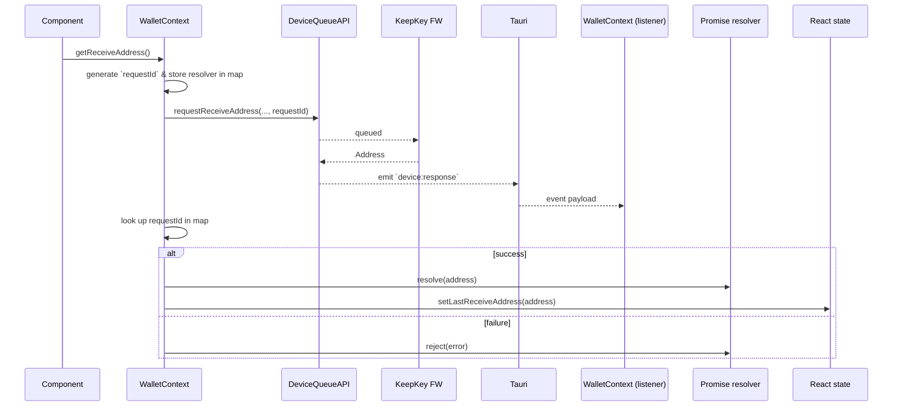

# Vault V2 – WalletContext Event Architecture

_Last updated: 2025-06-17_

## 1. Background
Vault V2 communicates with KeepKey devices **exclusively through the Rust-based Device Queue** (Tauri backend).  Every wallet action—fetching XPUBs, generating receive addresses, broadcasting transactions—enters the queue, and responses come back as `device:response` events.

Prior to this refactor the Receive tab
1. fired a `requestReceiveAddress` message,
2. **polled** `getQueueStatus` until a response arrived, and
3. **stored no global state** of the most-recent address.

The UI frequently became stuck because the polling promise missed the moment the backend replied.  We solved this by introducing a **robust event-to-promise bridge** inside `WalletContext` and exposing a `lastReceiveAddress` context value.

## 2. Key Concepts
| Concept | Purpose |
|---------|---------|
| **pendingReceiveRequests** (`Map<requestId, AddrResolver>`) | Tracks every in-flight receive-address request.  Added to map **before** the device queue call, ensuring we never miss a reply. |
| **AddrResolver** | `{ resolve, reject }` pair used by a Promise to deliver the result back to the UI |
| **lastReceiveAddress** (`state`) | React state updated whenever any receive-address response arrives.  Components may either `await getReceiveAddress()` *or* subscribe to this value for reactive updates. |
| **Single global `device:response` listener** | Central place that handles **all** queue responses.  No scattered per-component listeners—avoids leaks & race conditions. |

## 3. Flow – Generating a Receive Address


## 4. Why this Matters Going Forward
We expect **dozens of new queue-based actions** (sign PSBT, encrypt message, upgrade firmware, etc.), each potentially involving:
* multiple user interactions (tap device, approve, enter PIN)
* long-running operations

To stay maintainable we need:
1. **A single source of truth** for all queue responses.
2. **Deterministic mapping** between requests and UI state.
3. **Excellent visibility** for debugging & UX telemetry.

The current pattern gives us that foundation.

## 5. Extending the Pattern
1. **Add a per-action Pending Map**
   ```ts
   const pendingSignTxRequests = new Map<string, TxResolver>();
   ```
2. **Generate the `requestId` *first*, store resolvers, then queue to device** (never the opposite order).
3. **Handle the new response type** in the *same* global `device:response` listener.
4. **Expose minimal React state** (e.g., `lastSignedTxId`) only when components benefit from reactive updates.
5. **Clean up** – always `delete` the map entry on resolve **or** reject.

## 6. Logging & Debugging Guidance
* Prefix every log with a _TAG_ segment (`TAG + " | receive | "`) so DevTools filtering is easy.
* Log **requestId** in _every_ step.
* Keep `console.debug` for verbose queue monitoring; switch to `console.log`/`error` for high-value logs.

## 7. Testing Checklist
- [x] Receive tab shows address & QR without hangs.
- [x] `getReceiveAddress()` Promise resolves within 60 s or rejects on timeout.
- [x] Hot-plugging device does **not** leave stale pending entries.
- [x] Unit tests for mapper function → ensure correct entry removal.

## 8. Future Tooling Ideas
* Build a **Queue Inspector** dev-panel: list pending requests, their age, and associated component.
* Auto-generate React hooks per action (`useReceiveAddress`, `useSignTx`) that wrap the generic pattern.
* Push tracing spans to Sentry/OpenTelemetry for production diagnostics.

---
**Maintainers – Do’s & Don’ts**
* **DO**: generate `requestId` first, store the resolver, _then_ send to device.
* **DO**: clean up map entries in both success & error cases.
* **DON’T**: create additional `listen('device:response')` subscriptions in components—use the global handler only.
* **DON’T**: silence catch blocks; always `console.error` with `requestId`.

Happy hacking! 🚀
